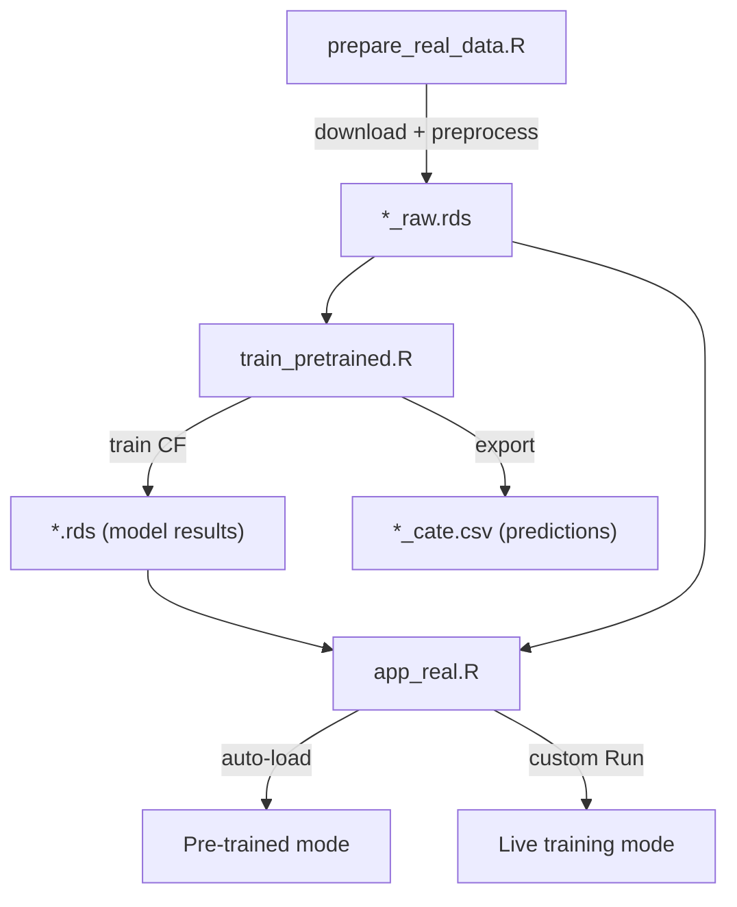

# Design — Real-Data Showcase

## Architecture

### Pipeline



### Data Format

#### Raw Data (`.rds`)
```r
list(
  data   = data.frame,      # Lenta/Criteo: full subsample
  men    = data.frame,       # Hillstrom only: men group
  women  = data.frame,       # Hillstrom only: women group
  X_cols = character vector, # Feature column names
  W_col  = "W",              # Treatment column name
  Y_options = named vector   # Available outcome columns
)
```

#### Model Results (`.rds`)
```r
list(
  tau_hat       = numeric,   # CATE estimates
  tau_lower     = numeric,   # 95% CI lower bound
  tau_upper     = numeric,   # 95% CI upper bound
  X_test        = matrix,    # Test features
  W_test        = numeric,   # Test treatment
  Y_test        = numeric,   # Test outcome
  X_cols        = character, # Feature names
  var_importance = data.frame(feature, importance),
  n_train       = integer,
  n_test        = integer,
  outcome       = character,
  dataset_label = character,
  trained_at    = POSIXct
)
```

### Key Design Decisions

- **Pre-trained dual mode**: App auto-loads `.rds` when user changes dataset/outcome (50ms). Custom Run button is optional for re-training with different hyperparameters. Avoids forcing user to wait for training.
- **Stratified subsampling**: Lenta uses stratified_sample() by W to preserve treatment/control ratio.
- **Criteo W column**: Use `exposure` (actual ad display, randomized) not `treatment` (always 1 in v2.1 — intent-to-treat).
- **Binary outcome clamping**: When Y ∈ {0,1}, clamp tau_hat to [-1, 1] to avoid nonsensical probability estimates.
- **File naming**: `{dataset}_{group}_{outcome}.rds` for Hillstrom (e.g., `hillstrom_men_visit.rds`); `{dataset}_{outcome}.rds` for others.

### Customer Segmentation Logic

```r
# seg_threshold: ±0.05 for binary, ±1.0 for spend
baseline_treated = mean(Y[W==1])
persuadable  = tau > +threshold
dnd          = tau < -threshold
neutral      = |tau| <= threshold
sure_thing   = neutral & baseline_treated > 0.5
lost_cause   = neutral & baseline_treated <= 0.5
```

### Uplift / Qini Curve

1. Sort test obs by τ̂ descending
2. cum_gain[i] = cumsum(Y_sorted) / total_conversions
3. qini = mean(cum_gain - random_baseline)
4. Thin to 300 points for Plotly performance
