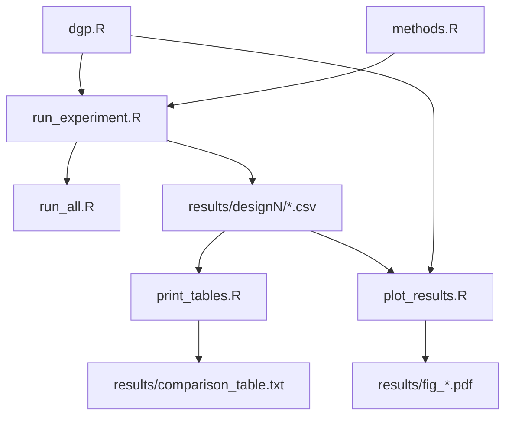

# Design — Simulation Reproduction

## Architecture

### Module Dependency Graph

### Data Flow

1. **dgp.R** — sinh dữ liệu theo 3 designs:
   - `gen_design1(n, d, seed)` → list(X, W, Y, tau)
   - `gen_design2(n, d, seed)` → list(X, W, Y, tau)
   - `gen_design3(n, d, seed)` → list(X, W, Y, tau)

2. **methods.R** — estimators:
   - `grow_causal_forest(X, W, Y, num_trees, sample_fraction, seed)` → grf object
   - `grow_propensity_forest(X, W, Y, num_trees, sample_fraction, seed)` → grf object
   - `predict_cf(forest, X_test)` → list(tau_hat, var_hat)
   - `predict_knn(X_train, W_train, Y_train, X_test, k)` → list(tau_hat, var_hat)
   - `compute_metrics(tau_hat, var_hat, tau_true)` → c(mse, coverage)

3. **run_experiment.R** — orchestration per cell:
   - Parse CLI args → load config → run R replications → save CSV
   - Design 1: Propensity Forest; Design 2/3: Double-Sample Trees
   - CF: sequential; kNN: parallel (parLapply on Windows)

4. **run_all.R** — orchestration all 54 cells:
   - Grid: 3 designs × 3 methods × 6 d-values = 54
   - Sequential system2() calls to run_experiment.R

### Design Decisions

- **grf over causalTree**: causalTree (original paper package) requires GCC ≤ 13 (Rtools43), incompatible with modern Rtools45. grf is the maintained successor by the same lab (grf-labs/Stanford). Trade-off: coverage 2–5% higher due to IJ variance being more conservative.
- **Propensity Forest emulation**: grf ≥ 2.0 removed `propensity_forest()`. Emulated by fitting `regression_forest(X, W)` for W.hat, then passing to `causal_forest(W.hat = ...)`.
- **kNN variance formula**: Paper uses sum-of-squares notation. R's `var()` divides by (k−1), so the formula simplifies to `(var(s1) + var(s0)) / k`.
